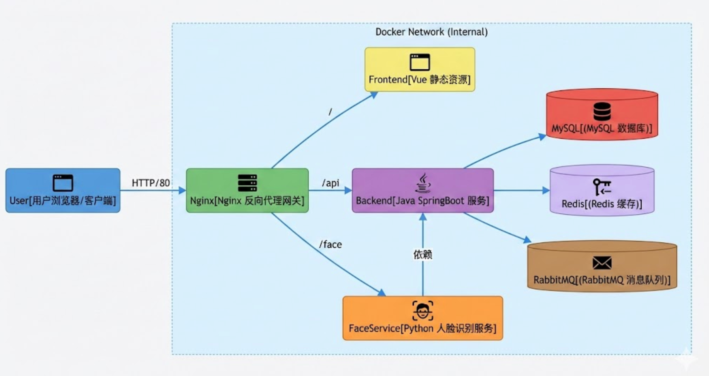

# 在线考试系统 Docker + Nginx 容器化部署文档

## 1. 部署架构概览

本系统采用前后端分离架构，并引入了 Python 人脸识别服务和各类中间件。为了简化运维与环境一致性，推荐使用 **Docker Compose** 进行全栈容器化部署。

### 1.1 系统拓扑图



### 1.2 容器服务规划

| 服务名称          | 镜像/技术栈         | 容器端口    | 宿主机映射端口 | 描述                                |
| :---------------- | :------------------ | :---------- | :------------- | :---------------------------------- |
| **nginx-gateway** | nginx:alpine        | 80          | 80             | 统一入口，托管前端静态与其 API 转发 |
| **exam-backend**  | openjdk:8-jre       | 8889        | -              | SpringBoot 核心业务后端             |
| **face-service**  | python:3.9          | 5000        | -              | Flask/FastAPI 人脸识别微服务        |
| **mysql-db**      | mysql:8.0           | 3306        | 3306           | 业务数据存储                        |
| **redis-cache**   | redis:alpine        | 6379        | 6379           | 缓存与 Session 存储                 |
| **rabbitmq**      | rabbitmq:management | 5672, 15672 | 15672          | 异步阅卷消息队列                    |

---

## 2. 环境准备

1.  **服务器**: Linux (CentOS 7+ / Ubuntu 20.04+), 建议 4 核 8G 以上配置（因运行多个中间件）。
2.  **软件依赖**:
    - Docker Engine
    - Docker Compose

```bash
# 安装 Docker & Compose (以 CentOS 为例)
yum install -y yum-utils
yum-config-manager --add-repo https://download.docker.com/linux/centos/docker-ce.repo
yum install -y docker-ce docker-ce-cli containerd.io docker-compose-plugin
systemctl start docker
```

---

## 3. 部署详细步骤

### 3.1 目录结构规划

建议在服务器 `/opt/exam-online` 下建立如下结构：

```text
/opt/exam-online
├── docker-compose.yml       # 核心编排文件
├── nginx/
│   ├── conf.d/
│   │   └── default.conf     # Nginx 配置文件
│   └── html/                # 前端 Build 后的 dist 文件
├── backend/
│   ├── Dockerfile
│   └── exam-admin.jar       # SpringBoot 打包文件
├── face/
│   ├── Dockerfile
│   ├── requirements.txt
│   └── app.py               # Python 源码
└── data/                    # 挂载数据卷(持久化)
    ├── mysql/
    ├── redis/
    └── rabbitmq/
```

### 3.2 配置文件编写

#### (1) docker-compose.yml

```yaml
version: "3.8"

services:
  # === 1. 基础设施层 ===
  mysql:
    image: mysql:8.0
    container_name: exam-mysql
    environment:
      MYSQL_ROOT_PASSWORD: root
      MYSQL_DATABASE: exam_system
    volumes:
      - ./sql/init.sql:/docker-entrypoint-initdb.d/init.sql
      - ./data/mysql:/var/lib/mysql
    networks:
      - exam-net

  redis:
    image: redis:alpine
    container_name: exam-redis
    volumes:
      - ./data/redis:/data
    networks:
      - exam-net

  rabbitmq:
    image: rabbitmq:management
    container_name: exam-rabbitmq
    ports:
      - "15672:15672" # 仅暴露管理后台
    environment:
      RABBITMQ_DEFAULT_USER: guest
      RABBITMQ_DEFAULT_PASS: guest
    networks:
      - exam-net

  # === 2. 业务逻辑层 ===
  backend:
    build: ./backend
    container_name: exam-backend
    restart: always
    environment:
      # 修改 application.yml 中的连接地址，使用服务名代替 localhost
      SPRING_DATASOURCE_URL: jdbc:mysql://mysql:3306/exam_system?useUnicode=true&characterEncoding=utf-8&serverTimezone=GMT%2B8
      SPRING_REDIS_HOST: redis
      SPRING_RABBITMQ_HOST: rabbitmq
    depends_on:
      - mysql
      - redis
      - rabbitmq
    networks:
      - exam-net

  face-service:
    build: ./face
    container_name: exam-face
    restart: always
    networks:
      - exam-net

  # === 3. 接入层 ===
  nginx:
    image: nginx:alpine
    container_name: exam-nginx
    ports:
      - "80:80"
    volumes:
      - ./nginx/html:/usr/share/nginx/html # 挂载前端打包文件
      - ./nginx/conf.d/default.conf:/etc/nginx/conf.d/default.conf
    depends_on:
      - backend
      - face-service
    networks:
      - exam-net

networks:
  exam-net:
    driver: bridge
```

#### (2) Nginx 配置 (default.conf)

整合前后端路由，解决跨域问题。

```nginx
server {
    listen       80;
    server_name  localhost;

    # 1. 前端静态资源
    location / {
        root   /usr/share/nginx/html;
        index  index.html index.htm;
        try_files $uri $uri/ /index.html; # Vue History 模式防 404
    }

    # 2. 后端 API 反向代理
    # 将 /api/xxxx 转发到 http://backend:8889/xxxx
    # 注意：如果后端接口未带 /api 前缀，需要 rewrite 去掉
    location /api/ {
        # 假设后端接口本身不带 /api 前缀，则使用 rewrite
        rewrite ^/api/(.*)$ /$1 break;

        proxy_pass http://backend:8889;
        proxy_set_header Host $host;
        proxy_set_header X-Real-IP $remote_addr;
    }

    # 针对当前项目，如果 controller 直接映射的是 /teacher, /student 等
    # 可以配置多个 location 或者统一加统一前缀
    location ~* ^/(common|teacher|student|admin)/ {
        proxy_pass http://backend:8889;
        proxy_set_header Host $host;
    }

    # 3. 人脸识别服务代理
    location /face/ {
        proxy_pass http://face-service:5000;
    }
}
```

#### (3) Backend Dockerfile

```dockerfile
# /opt/exam-online/backend/Dockerfile
FROM openjdk:8-jdk-alpine
VOLUME /tmp
ADD exam-admin.jar app.jar
ENTRYPOINT ["java","-Djava.security.egd=file:/dev/./urandom","-jar","/app.jar"]
```

#### (4) Face Service Dockerfile

```dockerfile
# /opt/exam-online/face/Dockerfile
FROM python:3.9-slim
WORKDIR /app
COPY requirements.txt .
RUN pip install --no-cache-dir -r requirements.txt -i https://pypi.tuna.tsinghua.edu.cn/simple
COPY . .
# 假设使用 flask
CMD ["python", "app.py"]
# 或者是 gunicorn
# CMD ["gunicorn", "-w", "4", "-b", "0.0.0.0:5000", "app:app"]
```

## 4. 部署操作流程

### 第一步：打包构建

1.  **前端**：进入 `Exam-Online-Frontend`，运行 `npm run build`。将生成的 `dist` 文件夹内容上传到服务器 `/opt/exam-online/nginx/html`。
2.  **后端**：进入 `Exam-Online-Backend/exam-admin`，运行 `mvn clean package`。将生成的 JAR 包上传到服务器 `/opt/exam-online/backend/exam-admin.jar`。
3.  **人脸服务**：将 Python 源码上传到 `/opt/exam-online/face/`。

### 第二步：启动服务

在 `/opt/exam-online` 目录下执行：

```bash
# 构建并后台启动所有服务
docker-compose up -d --build
```

### 第三步：验证

1.  查看日志确保启动成功：
    ```bash
    docker-compose logs -f backend
    ```
2.  访问浏览器：`http://服务器IP/`。
    - 页面应能正常加载（Nginx 直出）。
    - 登录接口请求应转发至后端。
    - 人脸识别功能应转发至 Python 服务。

## 5. 关键优化点

1.  **配置分离**：SpringBoot 的 `application.yml` 建议尽量使用 ENV 环境变量覆盖（如上文 `docker-compose.yml` 中的 `SPRING_DATASOURCE_URL`），避免修改 JAR 包这一层。
2.  **前端配置**：前端代码中 axios 的 `baseURL` 建议修改为 `/`（相对路径）或 `/api`，这样在生产环境会自动请求 Nginx 同源地址，由 Nginx 进行转发，避开跨域问题。
3.  **日志挂载**：建议把 Log 文件也挂载到宿主机（`- ./logs:/var/log`），方便排查问题。
